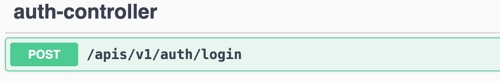
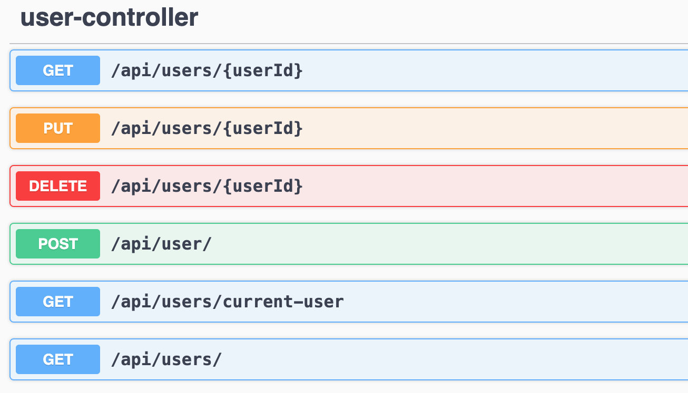
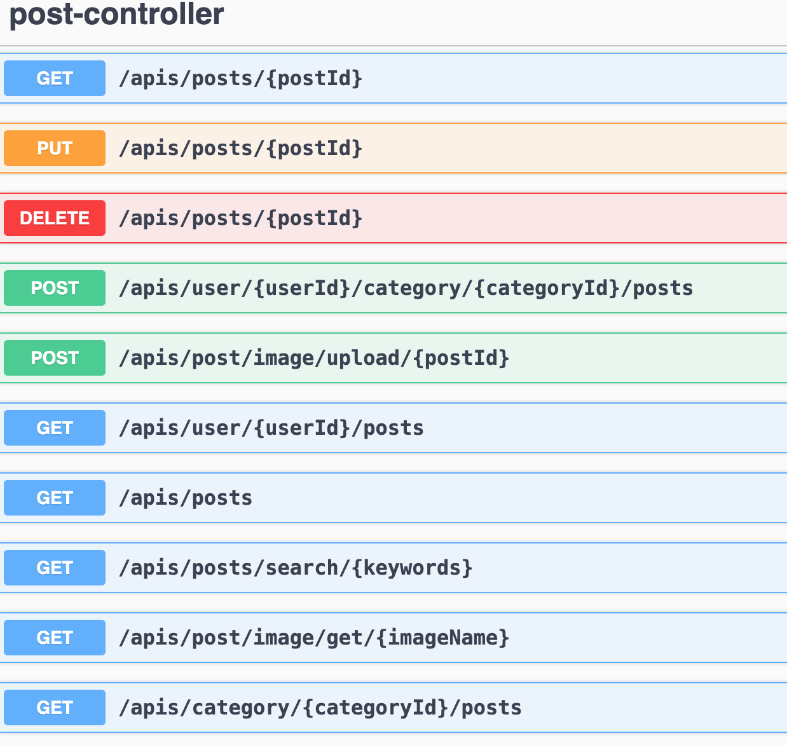
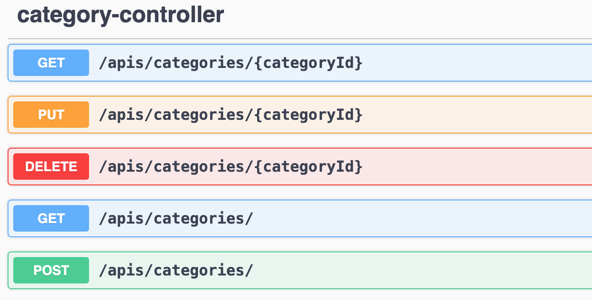
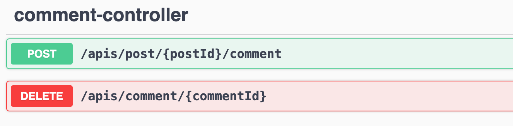
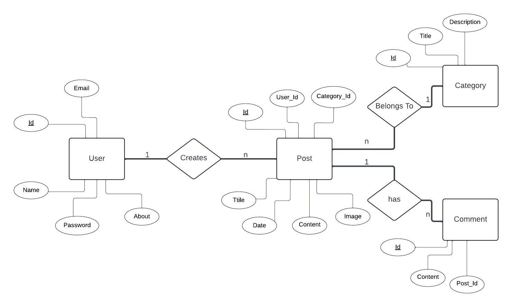

<h1 align="center" style="font-weight: bold;">Bloggin API Service 💻</h1>


<p align="center">This project is a Blogging API Service developed using the Spring Boot framework, allowing users to sign up, log in, create blog posts, and engage in discussions through comments on other users' posts. The application implements robust security features with Spring Security and JWT authentication. MySQL is integrated using JPA for efficient data storage and retrieval, ensuring smooth operation of the service. Additionally, REST API endpoints are documented using Swagger to enhance readability and accessibility for developers. The project was deployed on AWS cloud services, but due to limited free tier availability, the deployment has been discontinued. However, you can explore a recorded video of the deployed version of the project in this documentation.</p>


<p align="center">
<a href="https://drive.google.com/file/d/17PWZh-m-UC3JW26NDei4PWa5sPrabI0o/view?usp=sharing">📱 Explore the Project</a>
</p>

<h2 id="technologies">💻 Technologies</h2>

General:
- Java 21
- SpringBoot 3.2.2
- Spring Security
- JPA
- Swagger

For Dev Env:
- MySQL

For Prod Env:
- AWS
- EC2
- Elastic BeanStalk
- R2

<h2 id="clone">💻 Cloning</h2>

How to clone your project

```bash
git clone https://github.com/sehgal-sameep/blogging-api-service.git
```

<h2 id="technologies">💻 API-EndPoints </h2>







<h2 id="er-diagram">💻 ER-Diagram </h2>



<h2 id="documentations">💻 Documentations that might help </h2>

[📝 Swagger AWS Recorded Video](https://drive.google.com/file/d/17PWZh-m-UC3JW26NDei4PWa5sPrabI0o/view?usp=sharing)

[📝 SpringBoot 3.x.x](https://docs.spring.io/spring-boot/documentation.html)

[📝 Spring Security 6](https://docs.spring.io/spring-security/reference/index.html)


